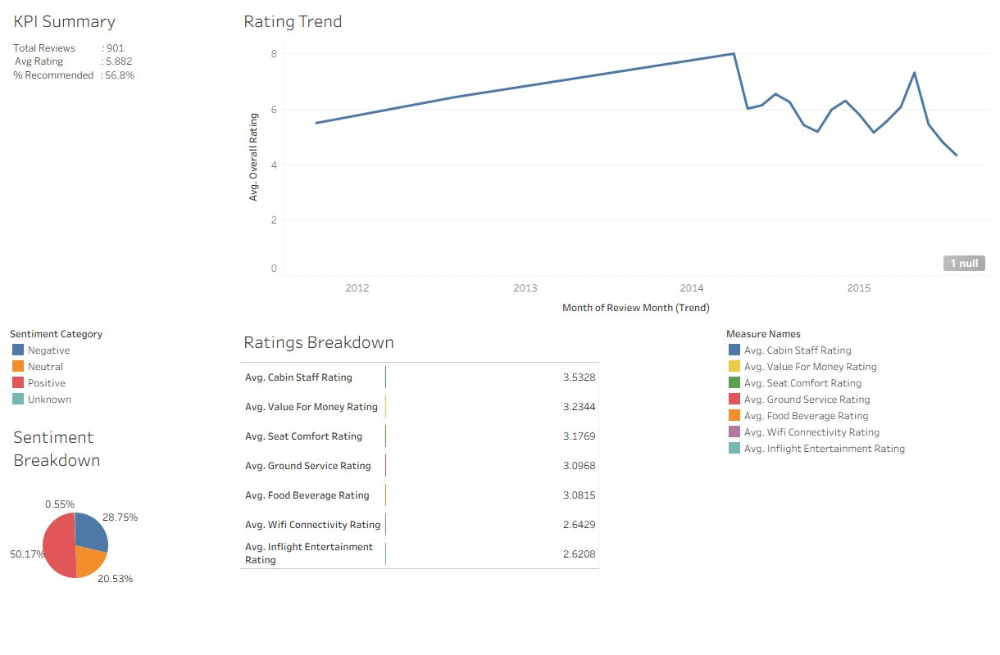
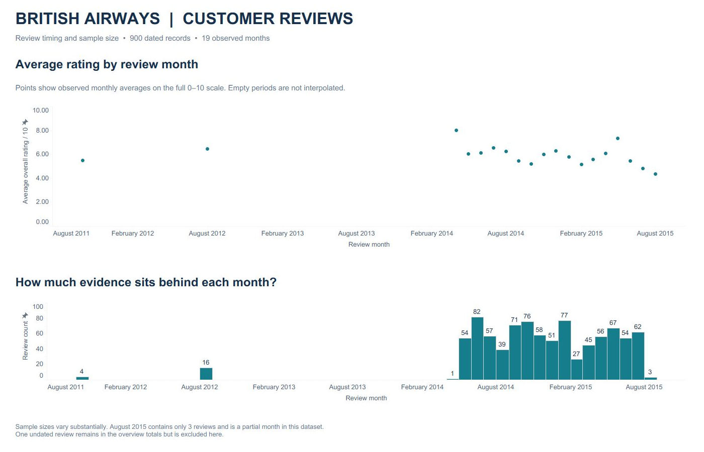

# British Airways Reviews in Tableau

I built this project to explore how reviewers rated their British Airways experience, which service areas stood out, and how the results varied across passenger groups and time.

The Tableau workbook uses the same cleaned review dataset as the SQL analysis and Excel summary in this repository.

**[View interactive dashboard](https://public.tableau.com/app/profile/jaydipsinh.gohil/viz/BritishAirwaysReviewsDashboard_17889618499830/OverviewTrends) · [Download Tableau workbook](British_Airways_Reviews_Final.twbx) · [Read case study](case_study.md) · [View SQL](ba_reviews_queries.sql)**

## At a glance

| Metric | Result |
| --- | --- |
| Review records | 901 |
| Average overall rating | 5.88 / 10, from 896 rated reviews |
| Recommendation rate | 56.8%, or 512 of 901 responses |
| Dated records | 900 across 19 observed months |
| Date coverage | October 2011 to August 2015, with gaps |

## Key findings

- Cabin staff received the highest average service rating: 3.53 out of 5 from 899 responses.
- Inflight entertainment averaged 2.62 out of 5 from 865 responses, making it a useful area for further investigation.
- Wi-Fi averaged 2.64, but only 14 reviews included a score, so that comparison needs caution.

## Dashboard previews

### Overview & Trends

Headline KPIs, service-rating comparisons, rating bands, and monthly observations. Service scores use a fixed 0–5 axis; overall ratings use 0–10. The note above the service chart makes the smaller Wi-Fi and ground-service samples visible.

### Monthly Trends

Monthly averages are paired with review counts. Points are deliberately left unconnected across missing periods. One undated review is excluded from these charts but remains in the overview totals.

These images are captures of the native Tableau workbook.

## Project files

| Resource | Contents |
| --- | --- |
| [Tableau workbook](tableau/British_Airways_Reviews.twbx) | Three dashboards with the data extract included |
| [Case study](case_study.md) | Approach, findings and interpretation |
| [Calculated fields](CALCULATED_FIELDS_library.md) | Workbook formulas and KPI definitions |
| [SQL analysis](ba_reviews_queries.sql) | Analysis queries and data-quality checks |
| [Excel workbook](BA_Reviews_Workbook.xlsx) | Companion data and KPI summary |
| [Cleaned data](data/ba_reviews_clean.csv) | The 901 review records |
| [Data notes](DATA_NOTES.md) | Coverage and source information |

## Open and explore

Download the TWBX file and open it in a compatible version of Tableau Public or Tableau Desktop. The workbook was checked in Tableau Public 2026.2 and includes its extract.

Use the Overview & Trends, Monthly Trends, and Segments & Geography tabs. Hover over marks for supporting values. Scroll the detail table and hover over a rating to read the associated review.

## Reading the results

This is a personal project using a historical review sample. It does not describe current airline performance or represent all passengers. Rating bands come from numerical scores, not sentiment analysis of the review text. Reviewer country is not a flight destination.

The supplied documentation attributes the data to Skytrax / airlinequality.com; the exact redistributed dataset URL and licence have not been verified. This project is independent of British Airways.
